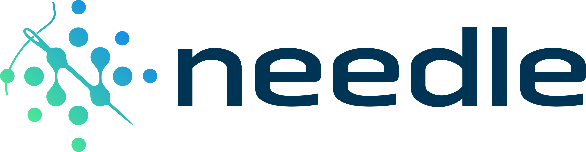

# needle

  

**NE**cessary **E**lements of **D**eep **LE**arning

A basic autograd engine with a minimalist module for implementing neural nets above it and GPU-supported array backend.  
It works by doing reverse mode AD (Automatic Differentiation) over the dynamically built computational graph.

This was a personal just for fun and learning project built using course assignments for [CMU's DL systems course](https://dlsyscourse.org/)  
